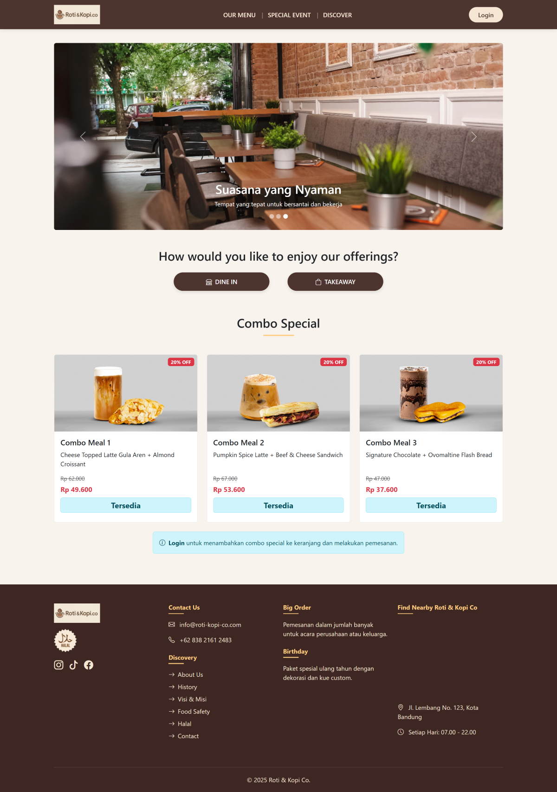
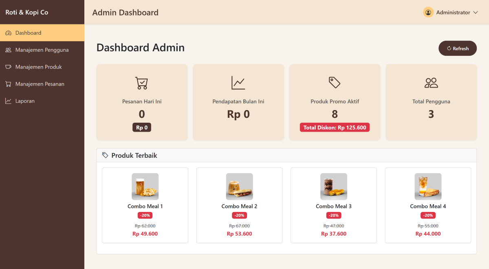
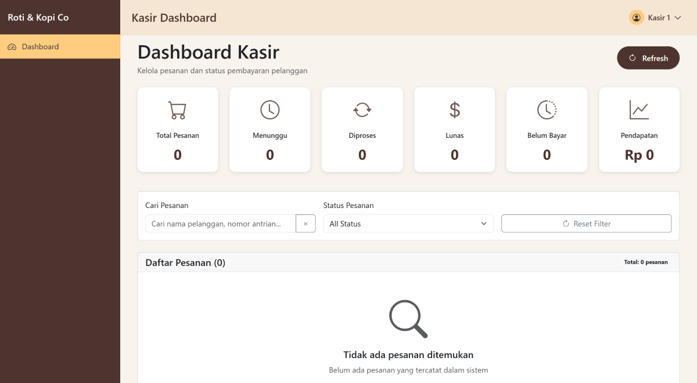

# Roti Kopi Co


Platform F&B (Food & Beverage) yang dibangun menggunakan React dan Bootstrap 5 untuk frontend, Express untuk backend, serta MySQL sebagai database. Sistem ini menyediakan pengalaman belanja online dengan fitur keranjang belanja, pembayaran melalui QR Code, dashboard admin untuk manajemen produk, serta modul kasir untuk pengelolaan transaksi.

---

## 📸 Tampilan Aplikasi

<table align="center">
  <tr>
    <td></td>
    <td></td>
    <td></td>
  </tr>
</table>

---

## ✨ Fitur

- **Responsive design untuk semua device**
- **Sistem authentication & authorization**
- **Integration payment QR Code**
- **Admin dashboard untuk manajemen produk**
- **Kasir dashboard untuk manajemen pembayaran**
- **Real-time inventory management**

---

## 🛠️ Teknologi yang Digunakan

- **React** - Library UI
- **Express** - Framework aplikasi web node.js
- **MySQL** - Relational Database Management System
- **Bootstrap** - Framework CSS
- **Vite** - Alat build dan server development

---

## 📋 Prasyarat

Sebelum memulai, pastikan telah menginstal:

- [Visual Studio Code](https://code.visualstudio.com/download)
- [XAMPP](https://sourceforge.net/projects/xampp/files/) (v7.4.33)
- [Node.js](https://nodejs.org/) (v20.19.6 LTS atau yang lebih baru)

---

## ⚡ Memulai dengan Cepat

1. **Clone repositori**

   ```bash
   git clone https://github.com/ReykaMR/roti-kopi-co.git
   cd roti-kopi-co
   ```

2. **Setup Database**
   
   - **Langkah 1:** Buka phpmyadmin
   - **Langkah 2:** Buat database dengan nama roti_kopi_co
   - **Langkah 3:** Import file roti_kopi_co (support semua versi mysql).sql

3. **Instal dependensi + Menjalankan server development**

   **Langkah 1:** Buka terminal untuk masuk ke dalam folder backend di visual studio code dengan menekan tombol (ctrl + `), lalu ketik:
   ```bash
   cd ./backend/  // Masuk ke folder backend
   npm install    // Instal dependensi
   npm run dev    // Jalankan server
   ```

   **Langkah 2:** Tambah terminal baru untuk masuk ke dalam folder frontend di visual studio code dengan menekan tombol (ctrl + shift + `), lalu ketik:
   ```bash
   cd ./frontend/  // Masuk ke folder frontend
   npm install     // Instal dependensi
   npm run dev     // Jalankan server
   ```

4. **Buka browser**

   Buka http://localhost:5173
